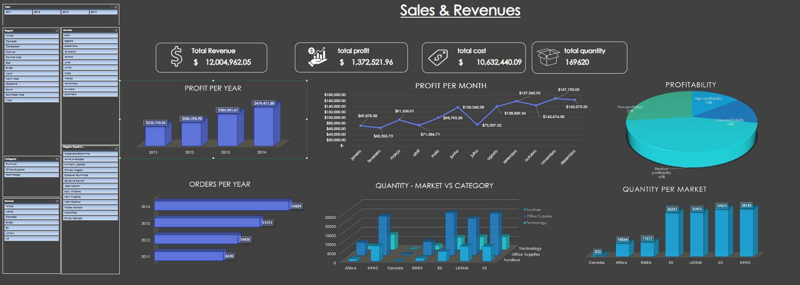
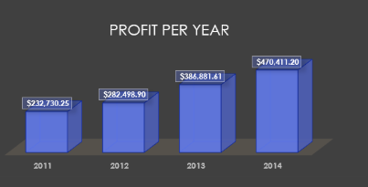
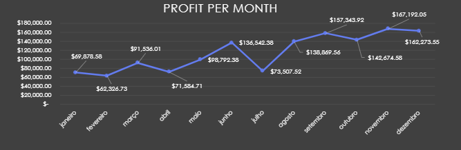
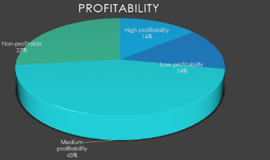
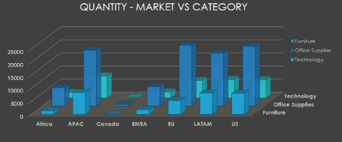
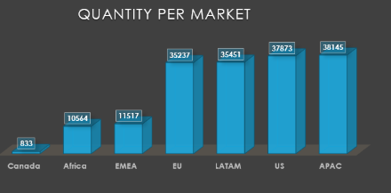

# Global-Superstore-Sales-Revenue-Analysis

## Project Overview

This project analyses Global Superstore's sales and revenue data across 4 years (2011–2014), 7 markets, and 3 product categories to identify profitability drivers, seasonal patterns, and market performance gaps. The analysis was built entirely in Excel using pivot tables, calculated fields, and an interactive dashboard.

**The critical finding:** 26% of all orders (13,134 out of 49,047) are non-profitable — more than 1 in 4 orders actively erodes margins. Identifying which products, markets, and segments drive these losses is the primary business value of this analysis.

**Tools & Technologies:** Microsoft Excel (Pivot Tables, Charts, Calculated Fields, Slicers, Interactive Dashboard)

---

## Executive Summary

| Metric | Value |
|--------|-------|
| Total Revenue | $12,004,962.05 |
| Total Profit | $1,372,521.96 |
| Total Cost | $10,632,440.09 |
| Profit Margin | 11.43% |
| Total Quantity Sold | 169,620 units |
| Total Orders | 49,047 |
| Markets | 7 (US, APAC, EU, LATAM, EMEA, Africa, Canada) |
| Period | 2011–2014 |

### Top Findings

- **26% of orders are non-profitable** (13,134 orders) — the single largest operational issue. Medium profitability dominates at 45%, while only 14% qualify as high profitability.
- **Profit doubled in 4 years** — from $232K (2011) to $470K (2014), a 102% increase. Order volume nearly doubled from 8,600 to 16,824.
- **September is the peak month** at $157K profit, while February is the weakest — a 2.5x seasonal swing that should drive inventory and staffing decisions.
- **APAC and US dominate volume** with 38K+ units each, but volume alone does not indicate profitability — the 11.43% overall margin suggests significant cost pressure.
- **Office Supplies lead quantity** across most markets, but the category mix varies significantly by geography.

---

## Dashboard

The interactive Excel dashboard includes slicers for Year, Region, Country, Category, and Market, enabling drill-down analysis across all dimensions. The KPI cards show four headline metrics, with six visualisations covering profit trends, seasonality, profitability segmentation, market distribution, and product-category breakdowns.

---

## 1. Profit Growth (2011–2014)

Profit grew consistently across all four years, with strong acceleration in 2013:

| Year | Profit | Orders | YoY Profit Growth |
|------|--------|--------|------------------|
| 2011 | $232,730.25 | 8,600 | — |
| 2012 | $282,498.90 | 10,430 | +21.4% |
| 2013 | $386,881.61 | 13,193 | +37.0% |
| 2014 | $470,411.20 | 16,824 | +21.6% |

The 2013 jump (+37%) is the strongest year-over-year growth, likely driven by market expansion. The growth from $232K to $470K represents a doubling of profit in 4 years, while order volume grew at a comparable rate (8,600 → 16,824). This suggests profit per order remained relatively stable rather than improving — the business grew through volume, not margin improvement.

**Key question:** If order volume doubled and profit doubled, but 26% of orders are non-profitable, what would profit look like if those loss-making orders were eliminated or repriced?

---

## 2. Seasonal Patterns

Monthly profit reveals a clear seasonal pattern with two peaks, a mid-year dip, and a slow start to the year:

| Month | Profit | Pattern |
|-------|--------|---------|
| January | ~$80K | Moderate start |
| February | $62,326.73 | **Annual low** |
| March | $69,878.58 | Recovery |
| April | $91,536.01 | Spring uptick |
| May | $71,584.71 | Dip |
| June | $136,542.38 | **Mid-year peak** |
| July | $98,792.38 | Slight decline |
| August | $73,507.52 | **Summer trough** |
| September | $157,343.92 | **Annual peak** |
| October | $138,869.56 | Strong Q4 start |
| November | $142,674.58 | Sustained |
| December | $167,192.05 | **Year-end peak** |

The data shows three distinct performance zones: a weak Q1 (January–March), a volatile mid-year (April–August with a June spike), and a consistently strong Q4 (September–December). The September peak ($157K) and December close ($167K) are the two highest months.

**Operational implication:** The February-to-September swing is 2.5x ($62K → $157K). Inventory stocking, staffing, and marketing spend should follow this curve — not a flat annual budget.

---

## 3. Profitability Segmentation

Orders are categorised into four profitability tiers, and the distribution is concerning:

| Segment | Orders | % of Total | Assessment |
|---------|--------|-----------|------------|
| Medium profitability | 22,120 | 45% | Core business |
| Non-profitable | 13,134 | 27% | **Critical — needs action** |
| Low profitability | 6,850 | 14% | At risk of turning negative |
| High profitability | 6,943 | 14% | Best performers |

**27% of orders generate negative margin.** This is the most actionable finding in the entire analysis. Combined with the 14% in low profitability, 41% of all orders are either losing money or barely breaking even.

The medium-profitability segment (45%) is the backbone of the business, but it also means only 14% of orders are genuinely high-margin. The business is volume-dependent with thin margins — any cost increase or pricing pressure would immediately threaten profitability.

**Questions this raises:**
- Which product sub-categories drive the 13,134 non-profitable orders?
- Are specific markets disproportionately responsible?
- Are these loss leaders driving profitable follow-on purchases, or pure margin destruction?

---

## 4. Market vs Category Distribution

The stacked bar chart breaks down quantity sold by market and product category (Furniture, Office Supplies, Technology):

| Market | Furniture | Office Supplies | Technology | Pattern |
|--------|-----------|----------------|------------|---------|
| APAC | High | Highest | High | Balanced, largest market |
| US | High | Highest | High | Balanced, second-largest |
| EU | Moderate | High | Moderate | Office Supplies dominated |
| LATAM | Moderate | High | Moderate | Similar to EU |
| EMEA | Low | Moderate | Low | Smaller, Office Supplies led |
| Africa | Low | Moderate | Low | Smallest active market |
| Canada | Minimal | Low | Minimal | Negligible volume |

Office Supplies consistently leads across every market, which makes sense for a B2B-oriented superstore. APAC and US show the most balanced category mix, suggesting more diversified customer bases. The smaller markets (EMEA, Africa, Canada) are heavily skewed toward Office Supplies, indicating they may be earlier in the product adoption cycle.

**Opportunity:** Technology and Furniture penetration in EU and LATAM is lower relative to their Office Supplies volume. Cross-selling or targeted promotions in these categories could drive incremental revenue.

---

## 5. Quantity by Market

| Market | Quantity | Share |
|--------|---------|-------|
| APAC | 38,145 | 22.5% |
| US | 37,873 | 22.3% |
| LATAM | 35,451 | 20.9% |
| EU | 35,237 | 20.8% |
| EMEA | 11,517 | 6.8% |
| Africa | 10,564 | 6.2% |
| Canada | 833 | 0.5% |

The top four markets (APAC, US, LATAM, EU) are remarkably close in volume, each contributing 20–22% of total quantity. This is a well-diversified geographic base for the core business.

EMEA and Africa are mid-tier at ~11K and ~10K respectively — large enough to matter but small enough to have growth potential. Canada at 833 units is essentially a test market.

**Critical gap:** Volume alone does not indicate profitability. APAC leads in quantity but may not lead in margin. The 11.43% overall profit margin needs to be broken down by market to identify which geographies are actually most profitable per order.

---

## 6. Strategic Recommendations

### Priority 1: Investigate and Fix Non-Profitable Orders
27% of orders (13,134) lose money. Break down by product sub-category, market, and customer segment to identify the specific drivers. Options include discontinuing loss-making products, repricing, adjusting discount policies, or renegotiating shipping costs. Even converting half of these to break-even would meaningfully improve the 11.43% margin.

### Priority 2: Capitalise on Q4 Seasonality
September through December consistently generates the highest profits ($157K–$167K monthly). Shift marketing spend, inventory stocking, and promotional campaigns to maximise this window. Conversely, reduce overhead commitments in Q1 when profit drops to $62K–$80K.

### Priority 3: Increase Technology & Furniture Penetration in EU/LATAM
EU and LATAM are strong Office Supplies markets (35K+ units each) but under-index on Furniture and Technology. Targeted promotions or bundling strategies could drive higher-margin category adoption in these already-active markets.

### Priority 4: Evaluate Canada Viability
At 833 units across 4 years, Canada is barely a market presence. Determine whether this represents an untapped opportunity requiring investment or a structural limitation that suggests reallocating resources to higher-performing markets.

### Priority 5: Shift from Volume Growth to Margin Growth
Profit doubled from $232K to $470K, but this was driven entirely by order volume (also doubled). Profit per order has not improved. The next phase of growth should focus on margin expansion — better product mix, reduced discounting, and elimination of non-profitable orders — rather than simply adding more volume.

---

## Data & Methodology

The analysis uses the Global Superstore dataset covering 51,290 transaction records from 2011 to 2014. Data was cleaned, validated, and analysed entirely in Excel using pivot tables, calculated fields for profitability segmentation, and an interactive dashboard with slicers for multi-dimensional drill-down.

The Excel workbook contains the following sheets: Dashboard (interactive summary), Orders (raw transactional data), Returns (return records), People (employee/salesperson data), and individual analysis sheets for each business question.

---

---

## Future Enhancements

- Break down profitability by product sub-category to identify the specific loss-making items
- Add profit margin analysis by market (not just volume)
- Customer-level analysis to identify high-value vs loss-generating accounts
- Returns impact quantification and root cause analysis
- Migrate to Power BI for richer interactivity and cross-filtering

---

*Analysis Period: 2011–2014 · Last Updated: January 2026*
